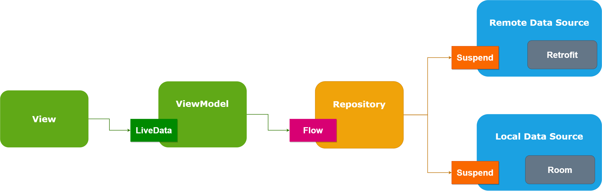
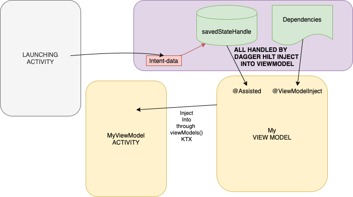

<!-- PROJECT SHIELDS -->
<!--
*** I'm using markdown "reference style" links for readability.
*** Reference links are enclosed in brackets [ ] instead of parentheses ( ).
*** See the bottom of this document for the declaration of the reference variables
*** for contributors-url, forks-url, etc. This is an optional, concise syntax you may use.
*** https://www.markdownguide.org/basic-syntax/#reference-style-links
-->
[![Contributors][contributors-shield]][contributors-url]
[![Forks][forks-shield]][forks-url]
[![Stargazers][stars-shield]][stars-url]
[![Issues][issues-shield]][issues-url]
[![MIT License][license-shield]][license-url]
[![LinkedIn][linkedin-shield]][linkedin-url]


<!-- PROJECT LOGO -->
<br />
<p align="center">
  <a href="https://github.com/duytuan001/FossilAndroidTest">
    
  </a>

  <h3 align="center">Fossil Screening Test v0.2</h3>

  <p align="center">
    Question2: Implement Alarm Android Application
    <br />
    <a href="https://github.com/duytuan001/FossilAndroidTest"><strong>Explore the docs »</strong></a>
    <br />
    <br />
    <a href="https://github.com/duytuan001/FossilAndroidTest/issues">Report Bug</a>
    ·
    <a href="https://github.com/duytuan001/FossilAndroidTest/issues">Request Feature</a>
  </p>
</p>


<!-- TABLE OF CONTENTS -->
<details open="open">
  <summary><h2 style="display: inline-block">Table of Contents</h2></summary>
  <ol>
    <li>
      <a href="#about-the-project">About The Project</a>
      <ul>
        <li><a href="#built-with">Built With</a></li>
        <li><a href="#installation">Installation</a></li>
      </ul>
    </li>
    <li><a href="#usage">Usage</a></li>
    <li><a href="#roadmap">Roadmap</a></li>
    <li><a href="#contributing">Contributing</a></li>
    <li><a href="#license">License</a></li>
    <li><a href="#contact">Contact</a></li>
  </ol>
</details>


<!-- ABOUT THE PROJECT -->
## About The Project

[![Product Name Screen Shot][product-screenshot-home]](https://example.com)[![Product Name Screen Shot][product-screenshot-detail]](https://example.com)

### Built With

* Android MVVM Architecture, Kotlin language
* Module: core (common lib&code), question1 (TODO), question2 (Alarm app), question3 (TODO)
* DI: Hilt
* DB: Room
* ViewModel, LiveData, Flow, DataBinding, Paging, Notification, Dark Theme
* Alarm service, Drag to dismiss Activity, SleepTimePicker lib





### Installation

1. Clone the FossilAndroidTest
   ```sh
   git clone https://github.com/duytuan001/FossilAndroidTest.git
   ```
2. Importing Source Code into Android Studio v4. Build and run the question2 app.


<!-- USAGE EXAMPLES -->
## Usage
* Set multiple alarms
* Alarm configuration: sound, vibration, label, enabled by week days


<!-- ROADMAP -->
## Roadmap

See the [open issues](https://github.com/duytuan001/FossilAndroidTest/issues) for a list of proposed features (and known issues).


<!-- CONTRIBUTING -->
## Contributing

Contributions are what make the open source community such an amazing place to be learn, inspire, and create. Any contributions you make are **greatly appreciated**.

1. Fork the Project
2. Create your Feature Branch (`git checkout -b feature/AmazingFeature`)
3. Commit your Changes (`git commit -m 'Add some AmazingFeature'`)
4. Push to the Branch (`git push origin feature/AmazingFeature`)
5. Open a Pull Request


<!-- LICENSE -->
## License

Distributed under the MIT License. See `LICENSE` for more information.


<!-- CONTACT -->
## Contact

Tuan Pham - [email](mailto:duytuan.bkit@gmail.com)

Project Link: [https://github.com/duytuan001/FossilAndroidTest](https://github.com/duytuan001/FossilAndroidTest)


<!-- MARKDOWN LINKS & IMAGES -->
<!-- https://www.markdownguide.org/basic-syntax/#reference-style-links -->
[contributors-shield]: https://img.shields.io/github/contributors/duytuan001/FossilAndroidTest.svg?style=for-the-badge
[contributors-url]: https://github.com/duytuan001/FossilAndroidTest/graphs/contributors
[forks-shield]: https://img.shields.io/github/forks/duytuan001/FossilAndroidTest.svg?style=for-the-badge
[forks-url]: https://github.com/duytuan001/FossilAndroidTest/network/members
[stars-shield]: https://img.shields.io/github/stars/duytuan001/FossilAndroidTest.svg?style=for-the-badge
[stars-url]: https://github.com/duytuan001/FossilAndroidTest/stargazers
[issues-shield]: https://img.shields.io/github/issues/duytuan001/FossilAndroidTest.svg?style=for-the-badge
[issues-url]: https://github.com/duytuan001/FossilAndroidTest/issues
[license-shield]: https://img.shields.io/github/license/duytuan001/FossilAndroidTest.svg?style=for-the-badge
[license-url]: https://github.com/duytuan001/FossilAndroidTest/blob/master/LICENSE.txt
[linkedin-shield]: https://img.shields.io/badge/-LinkedIn-black.svg?style=for-the-badge&logo=linkedin&colorB=555
[linkedin-url]: https://linkedin.com/in/duytuan001
[product-screenshot-home]: screenshots/home.png
[product-screenshot-detail]: screenshots/detail.png
